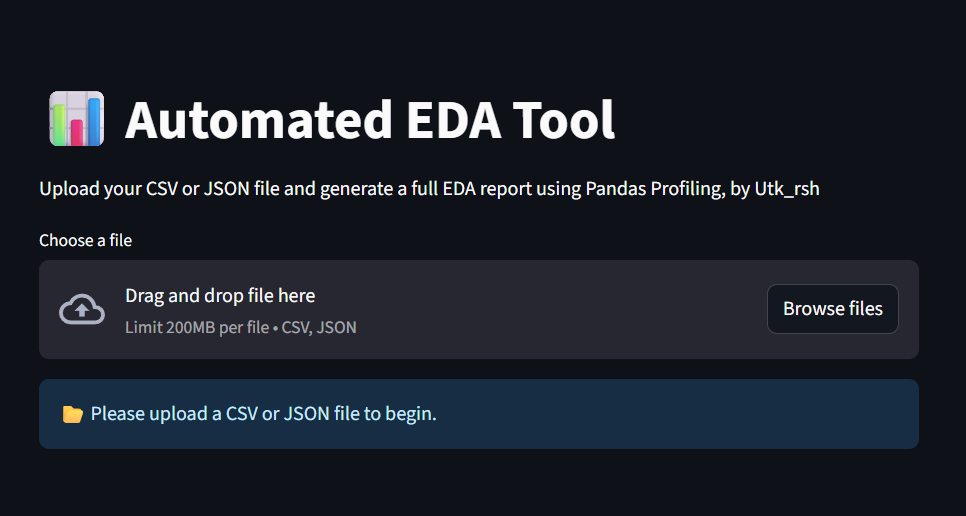
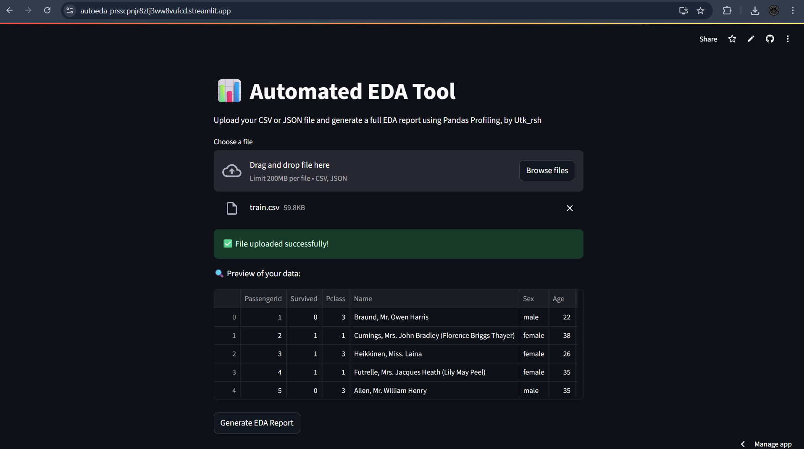
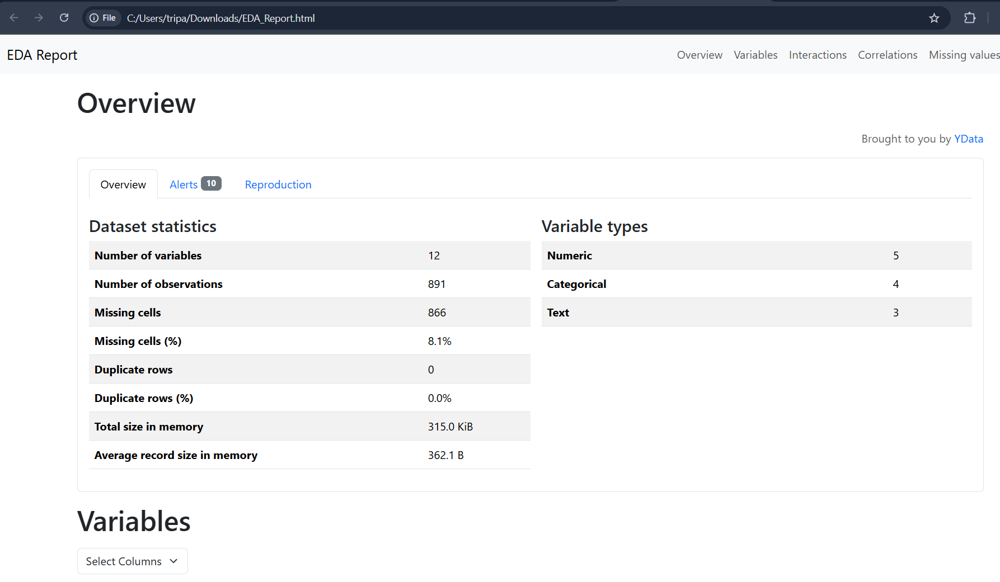

# 🔍 autoEDA – Automated Exploratory Data Analysis Web App

Welcome to **autoEDA**, a beginner-friendly and powerful web application built with **Streamlit** that helps you perform **Automated Exploratory Data Analysis** (EDA) on your datasets with just a few clicks.

Made with ❤️ by **Utkarsh Tripathi**  
<br>

---

## 🌐 Live App

You can try the deployed version of the app here:
👉 **[autoEDA – Explore Your Data Instantly](https://autoeda-prsscpnjr8ztj3ww8vufcd.streamlit.app/)**

> No setup required — just upload a `.csv` or `.json` file and download your EDA report in seconds!

📌 **Note:** The app may take 10–20 seconds to load for the first time due to Streamlit’s free hosting behavior.

---

## 📌 Features

✨ Upload your dataset in **CSV** or **JSON** format  
⚡ Instant generation of EDA report using **ydata-profiling**  
📥 Downloadable HTML report with your name and timestamp  
💻 Simple, clean, and responsive UI  
📊 Supports large datasets and advanced statistics  
🧪 Suitable for beginners & data scientists alike  

---

## 📂 Supported File Formats

- `.csv` (Comma Separated Values)  
- `.json` (JavaScript Object Notation)

---

## 🚀 How to Run Locally

### 🔧 1. Clone the repository

```bash
git clone https://github.com/yourusername/autoEDA.git
cd autoEDA
````

### 🐍 2. Create and activate virtual environment

Make sure you have **Python 3.10** installed (see version note below).

```bash
py -3.10 -m venv myenv
myenv\Scripts\activate   # On Windows
```

### 📦 3. Install dependencies

```bash
pip install -r requirements.txt
```

### ▶️ 4. Launch the Streamlit app

```bash
streamlit run auto_eda.py
```

---

## 📸 Screenshots

Here’s a quick visual walkthrough of the app interface and the generated EDA report:

### 🗂️ 1. File Upload Interface

Drag and drop your `.csv` or `.json` file easily.



---

### 🧾 2. Data Preview Table

Once uploaded, get a quick preview of the first few rows.



---

### 📊 3. Downloadable EDA Report (HTML)

Auto-generated report includes summary, charts, missing value stats, correlations, and more.



---

## ⚠️ Version Issues We Faced (📚 Real-World Debugging)

During development, we faced several version-related errors while installing `ydata-profiling`, especially:

* ❌ **Python 3.11+ not supported by many profiling packages**
* ❌ `ModuleNotFoundError: No module named 'cgi'` during `pandas-profiling` installation
* ❌ Incompatible dependencies when using older virtual environments

### ✅ Final Solution

> ✔️ We used **Python 3.10**
> ✔️ Created fresh virtual environment:
> `py -3.10 -m venv myenv`
> ✔️ Installed the latest compatible version of `ydata-profiling`

---

## 📁 File Structure

```bash
AUTOMATED_EDA/
├── auto_eda.py              # Main Streamlit app
├── requirements.txt         # Required packages
├── myenv/                   # Virtual environment folder
└── README.md                # Project documentation
```

---

## 🙋‍♂️ Author

**Utkarsh Tripathi**

> Passionate beginner learning Data Science and Python development
> Connect: [LinkedIn](https://www.linkedin.com/) | [GitHub](https://github.com/)

---

## 🧠 Future Improvements

* Add support for Excel files (`.xlsx`)
* Deploy on Streamlit Cloud
* Add theme toggle (dark/light mode)
* Generate report preview inside the app

---

## 📄 License

This project is open-source and free to use under the MIT License.

---

> 🚀 “Data speaks louder when analyzed properly. Let autoEDA do the talking for you.”
> – *Utkarsh Tripathi*

```

---

### ✅ Final Touch

📌 **Place this file as `README.md` inside your `AUTOMATED_EDA` folder.**  
Let me know if you want:
- A logo/image designed for the project  
- To deploy it on **Streamlit Cloud**  
- To publish it on **GitHub** (I’ll guide you step-by-step)

Proud of your work, Utkarsh — this is a great first project!
```
